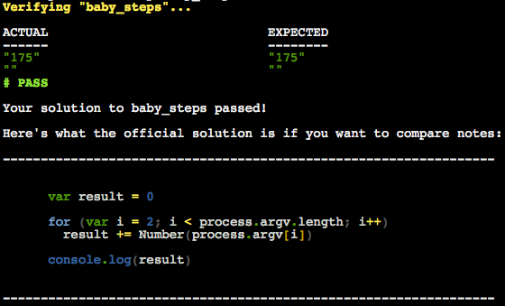

#Tutorial 03 - Bitewise
**Learn how to manipulate binary data in node.js and HTML5 browsers**

*All content is written and produced by [http://nodeschool.io](http://nodeschool.io). Please see the credits at the bottom of this page and if you have learnt a lot from these tutorials, please make a donation (also at the bottom).*

#Video
If you prefer a video rather than reading the instructions below, there is a video that runs through the Codio + Nodeschool.io system (yes, it's a tutorial on how to use the tutorial) : [https://vimeo.com/86100550](https://vimeo.com/86100550)

#Installation
1. Create an account with http://codio.com (don't be frightened, it's free for all public projects).
1. You're probably looking at this in GitHub already but if not, go to [https://github.com/codio](https://github.com/codio) and search for "Nodeschool", then select the tutorial you want.
2. Copy the SSH or HTTPS url from beneath al the GitHub settings on the right hand side (NOT the main browser page url).
3. Go to [Create Project](https://codio.com/s/docs/console/creating/) in your Codio Dashboard, select the Git tab and paste in the url you just copied.
4. Press Create Project and you'll be in the IDE with your tutorial project ready and waiting.

You'll now need to install the Nodeschool tutorial (each one is an npm package) onto your project's Box. There are two ways to do this ...

- Hands Dirty: open up a Terminal with from the 'Tools->Terminal' menu, then enter `npm install -g bytewiser@latest`.
- Lazy Way: click on the "Install Bytewiser" menu item. Once installed, you can close that tab.

#2 Writing your code
There are two different ways you can use Codio to run the Nodeschool.io tutorials. You can switch between them at any time. The great thing is that your code is neatly organized into lessons that you can refer back to later.

- **Tutorial Mode** : select the 'Tools->Tutorial' menu item. Each lesson is presented with a Code window on the left and the instructions on the right, which can be scrolled through and left in place while you code. You can navigate between lessons using the buttons above the instructions.
- **Manual Mode** : open up the lessons folders and you will see a filename similar to the folder name. You can write your code here and click on the blue icon in the gutter to open up the instructions popup.

#Testing your code
There are 2 ways you can test out your code using Node.js.

###1. The Easy Way: Add an entry to the 'Run' menu
The easiest and fastest way of working is to modify the 'Run' menu (second dropdown menu from the right). To do this open up the `.codio` file in the root of the project. You should see a preconfigured item ...

  "Run with Node" : "node {{filepath}} 3 4 5"

This command will always run the current code using node in a terminal window. You **must** have your code tab selected in the IDE before you press it or you will get a nonsense error. 

Each lesson requires different arguments so when you switch lessons, you should modify these arguments to suit. Now, when you in the 'write/test' cycle you can simply press the "Run with Node" menu option. 

###2. Shell out to the Terminal
You can open a Terminal window at any time by selecting the 'Tools->Terminal' menu item. Your terminal defaults to the `~/workspace` folder, which equates to the root of your Codio code project. If you are writing your code in the lesson folder (for example `02_hexadecimal_encoding`) then you will need to `cd` into that folder, so something like this

    cd 02_hexadecimal_encoding
    node baby_steps.js 1 2 3

#Running your Code via the Tutorial system
When you've got your code to the point where you think it is ready for the Tutorial system to check it, you should select the 'Run Lesson' item from the 'Run' menu. The tutorial system will automatically supply any required arguments to your project as required by the current lesson. You can see the 'Run Lesson' item in the above menu screenshot.

#Verifying your code
Once you think you have completed the challenge, select the 'Verify Lesson' option from the 'Run' dropdown menu. The output will be shown in the console window. If is passes, you will see something like this

#Which lessons have I successfully completed?
If you press the "Completed Lessons" command from the same menu, you will be shown in the console the list of all challenges that are already completed. You will see the following screen in the Terminal window hat appears. Completed lessons are clearly marked on the right.

#Cheating (checking the recommended solution)
Each lesson comes with a `solution.js` file. Try to avoid looking at it other than for verification purposes. We have highly sophisticated algorithms built into Codio that will detect any forms of cheating, peeking (however quick and subtle) and will publicly expose to your peers.

#Doing everything from the command line
For completeness sake, you can do everything from the command line rather than using Codio. Just open up the Terminal window from 'Tools->Terminal'.

Each tutorial is installed as node module that can be run from the command line. If you take a look at the [http://nodeschool.io](http://nodeschool.io) documentation, you can see how everything can be done from the command line.

#Other Tutorials
[http://nodeschool.io](http://nodeschool.io) has a several excellent tutorials. We have packaged these up so they run within Codio and the full set can be found on our [Nodeschool Tutorial page.](http://codio.com/tutorials)

#Credits

The Nodeschool tutorials are the much excellent work of the following hackers

Rod Vagg ([github/rvagg](https://github.com/rvagg), [twitter@rvagg](http://twitter.com/rvagg)), 
Andrey Sidorov ([github/sidorares](https://github.com/sidorares), [twitter@sidorares](http://twitter.com/sidorares)), 
Julián Duque ([github/julianduque](https://github.com/julianduque), [twitter@julian_duque](http://twitter.com/julian_duque)), 
Lars-Magnus Skog ([github/ralphtheninja](https://github.com/ralphtheninja), [twitter@ralphtheninja](http://twitter.com/ralphtheninja)), 
Tim Inman ([github/thehack](https://github.com/thehack), [twitter@timinman](http://twitter.com/timinman)), 
Dan Flettre ([github/Flet](https://github.com/Flet), [twitter@flettre](http://twitter.com/flettre)) 

##Donations
If you feel you have benefitted from this or the other tutorials, how about [donating to Rodd Vagg using gittip](https://www.gittip.com/rvagg/)